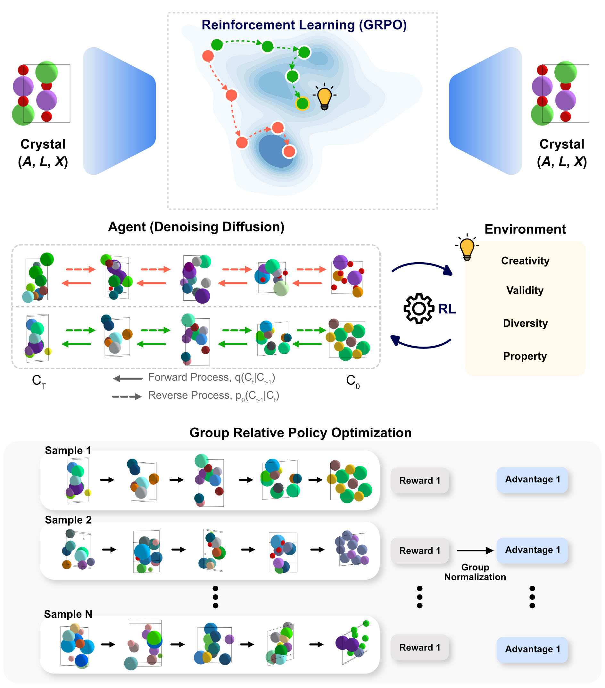

# Chemeleon2

A reinforcement learning framework in latent diffusion models for crystal structure generation using group relative policy optimization.

<p align="center">
  
</p>

<p align="center">
  <a href="https://arxiv.org/abs/2511.07158"></a>
  <a href="https://hspark1212.github.io/chemeleon2/"></a>
  <a href="https://github.com/hspark1212/chemeleon2/releases"></a>
  <a href="https://opensource.org/licenses/MIT"></a>
</p>

## Overview

Chemeleon2 implements a three-stage pipeline for crystal structure generation:

1. **VAE Module**: Encodes crystal structures into latent space representations
2. **LDM Module**: Samples crystal structures in latent space using diffusion Transformer
3. **RL Module**: Fine-tunes the LDM with **custom reward functions** to optimize for specific material properties

**Key Feature:** Design custom reward functions to guide generation toward desired properties (band gap, density, stability, etc.) using a simple Python interface.

<p align="center">
  
</p>

## Installation

```bash
# Clone the repository
git clone https://github.com/hspark1212/chemeleon2
cd chemeleon2

# Install dependencies with uv
uv sync
```

> **Tip:** `uv sync` installs dependencies based on the `uv.lock` file, ensuring reproducible environments. If you encounter issues with `uv.lock` (e.g., lock file conflicts or compatibility problems), you can use `uv pip install -e .` as an alternative to install the package in editable mode directly from `pyproject.toml`.

### Optional Dependencies

```bash
# Development tools (pytest, ruff, pyright, etc.)
uv sync --extra dev

# Training dependencies for RL rewards (mace-torch, smact)
uv sync --extra training
```

### PyTorch with CUDA

After completing `uv sync`, install a PyTorch version compatible with your CUDA environment to prevent compatibility issues.
For version-specific installation commands, visit the [PyTorch official website](https://pytorch.org/get-started/previous-versions/).

```bash
# Example: PyTorch 2.7.0 with CUDA 12.8
uv pip install torch==2.7.0 torchvision==0.22.0 torchaudio==2.7.0 --index-url https://download.pytorch.org/whl/cu128
```

For detailed installation instructions, see the [Installation Guide](./docs/getting-started/installation.md).

## Quick Start

For a simple walkthrough of sampling and evaluation, see [tutorial.ipynb](./tutorial.ipynb).

For more detailed guides:
- [Installation Guide](./docs/getting-started/installation.md) - Set up your environment
- [Quick Start Guide](./docs/getting-started/quickstart.md) - Generate your first structures

## Custom Rewards

Chemeleon2's RL module enables you to guide crystal generation toward specific material properties by defining custom reward functions. This is the framework's key differentiator for targeted materials discovery.

### Quick Example

Create a reward that optimizes for high atomic density:

```python
# custom_reward/atomic_density.py
from src.rl_module.components import RewardComponent
import torch

class AtomicDensityReward(RewardComponent):
    def compute(self, gen_structures, **kwargs):
        rewards = [s.density for s in gen_structures]
        return torch.as_tensor(rewards)
```

Then configure and train:

```yaml
# configs/custom_reward/atomic_density.yaml
rl_module:
  reward_fn:
    components:
      - _target_: custom_reward.atomic_density.AtomicDensityReward
        weight: 1.0
        normalize_fn: std
```

```bash
python src/train_rl.py custom_reward=atomic_density
```

### Built-in Reward Components

Chemeleon2 provides ready-to-use reward components:

| Component | Purpose |
|-----------|---------|
| **CreativityReward** | Reward unique and novel structures |
| **EnergyReward** | Penalize high energy above convex hull |
| **StructureDiversityReward** | Encourage diverse crystal geometries |
| **CompositionDiversityReward** | Encourage diverse chemical compositions |
| **PredictorReward** | Use trained ML models as reward functions |

Mix and match components for multi-objective optimization:

```yaml
components:
  - _target_: src.rl_module.components.CreativityReward
    weight: 1.0
  - _target_: src.rl_module.components.EnergyReward
    weight: 0.5
  - _target_: custom_reward.atomic_density.AtomicDensityReward
    weight: 1.0
```

### Tutorials

Learn by example with our detailed tutorials:

- **[Atomic Density Tutorial](./docs/user-guide/rewards/atomic-density.md)** - Simple custom reward walkthrough
- **[DNG Reward Tutorial](./docs/user-guide/rewards/dng-reward.md)** - Multi-objective optimization (paper configuration)
- **[Predictor Reward Tutorial](./docs/user-guide/rewards/predictor-reward.md)** - Property optimization with ML models

For a complete guide, see the [Custom Rewards Documentation](./docs/user-guide/rewards/index.md).

## Training

Chemeleon2 uses a three-stage training pipeline: VAE → LDM → RL.

### Quick Commands

```bash
# Train VAE
python src/train_vae.py experiment=mp_20/vae_dng

# Train LDM (requires VAE checkpoint)
python src/train_ldm.py experiment=mp_20/ldm_base

# Train RL with custom rewards (requires LDM checkpoint)
python src/train_rl.py custom_reward=rl_dng
```

### Training Guides

For detailed instructions on each stage:

- [VAE Training](./docs/user-guide/training/vae.md) - Learn latent representations
- [LDM Training](./docs/user-guide/training/ldm.md) - Diffusion model training
- [RL Training](./docs/user-guide/training/rl.md) - Fine-tune with rewards
- [Predictor Training](./docs/user-guide/training/predictor.md) - Train property predictors

For evaluation and metrics, see the [Evaluation Guide](./docs/user-guide/evaluation.md).

## Benchmarks

To benchmark de novo generation (DNG), 10,000 sampled structures are available in the `benchmarks/dng/` directory:

- **MP-20**: [`chemeleon2_rl_dng_mp_20.json.gz`](benchmarks/dng/chemeleon2_rl_dng_mp_20.json.gz) - 10,000 structures using RL-trained model on MP-20
- **Alex-MP-20**: [`chemeleon2_rl_dng_alex_mp_20.json.gz`](benchmarks/dng/chemeleon2_rl_dng_alex_mp_20.json.gz) - 10,000 structures using RL-trained model on Alex-MP-20

Load with:

```python
from monty.serialization import loadfn
structures = loadfn("benchmarks/dng/chemeleon2_rl_dng_mp_20.json.gz")
```

These models were trained with the [DNG multi-objective reward](./docs/user-guide/rewards/dng-reward.md).

## Contributing

We welcome contributions! Please see [CONTRIBUTING.md](./docs/contributing.md) for detailed setup instructions, development workflow, and guidelines.

## BibTex

```plain
@article{Park2025chemeleon2,
  title={Guiding Generative Models to Uncover Diverse and Novel Crystals via Reinforcement Learning},
  author={Hyunsoo Park and Aron Walsh},
  year={2025},
  url={https://arxiv.org/abs/2511.07158}
}
```

## References

This work is inspired by the following projects:

1. https://github.com/facebookresearch/DiT

2. https://github.com/facebookresearch/all-atom-diffusion-transformer

3. https://github.com/kvablack/ddpo-pytorch

4. https://github.com/open-thought/tiny-grpo

## License

Chemeleon2 is licensed under the MIT License. See [LICENSE](LICENSE) for more information.